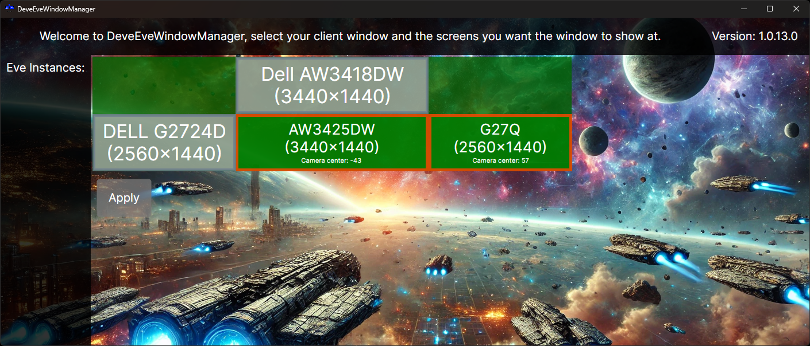

# DeveEveWindowManager

DeveEveWindowManager is a window management tool for **EVE Online** that lets you position and resize your EVE client across one or multiple monitors. Select your EVE instance, pick the screens you want it to span, and the app automatically moves and resizes the window to fit — making multi-monitor setups effortless. It also calculates the ideal camera center for each screen so your viewpoint stays correctly aligned across your displays.

Built with [Avalonia UI](https://avaloniaui.net/).

## Screenshot

